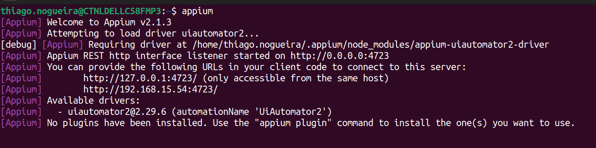
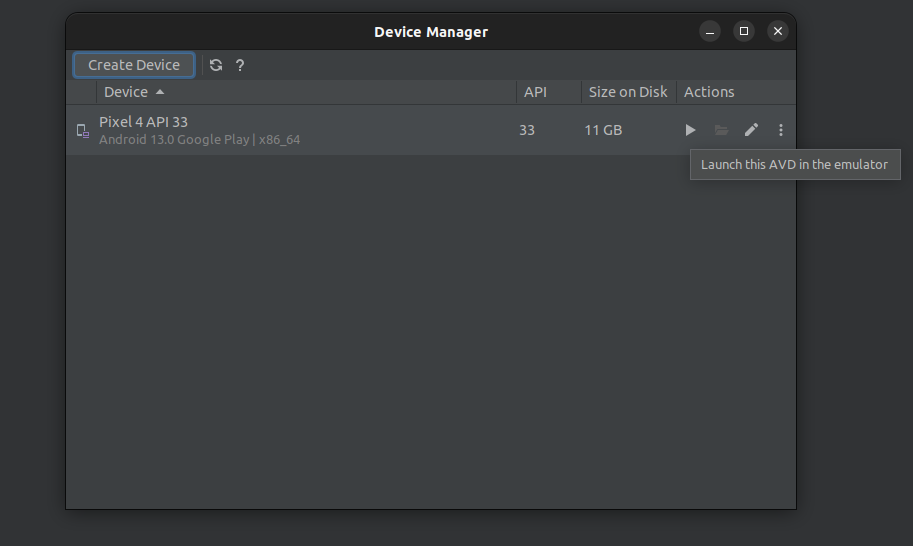
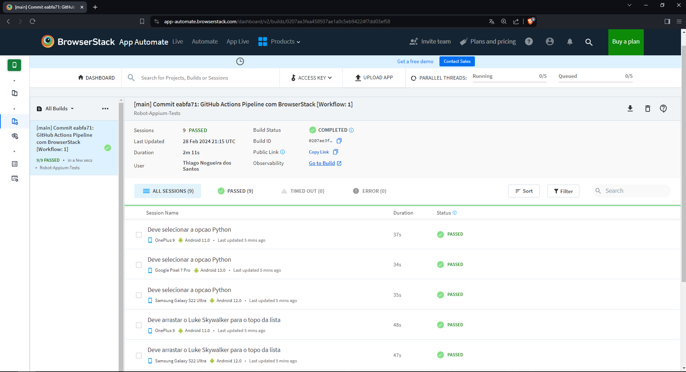
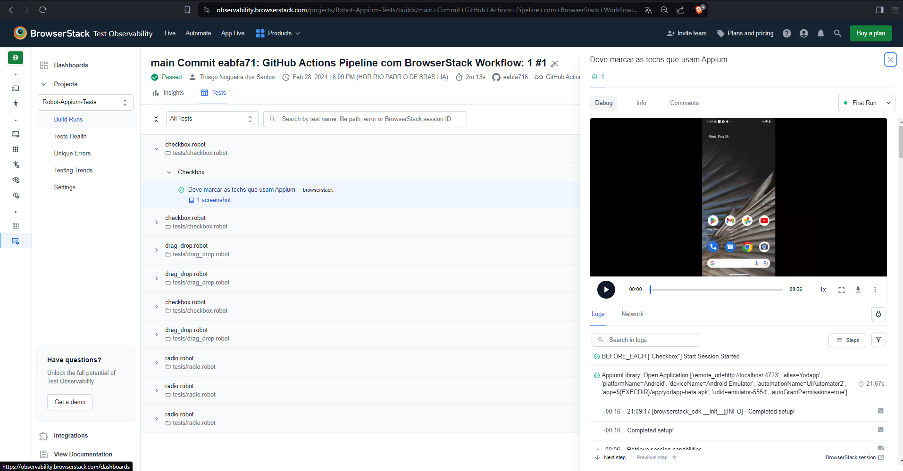

# Automação de testes Mobile com Robot Framework e Appium.

[](https://github.com/thinogueiras/Robot-Appium-Tests/actions/workflows/browserstack-testing.yml)

## Pré-requisitos mínimos de ambiente:

[Java](https://www.oracle.com/br/java/technologies/downloads/#java11) 11.0.x.

[Node.js](https://nodejs.org/en) 18.17.x.

[Python](https://www.python.org/downloads/) 3.11.x.

[Android Studio](https://developer.android.com/studio).

```
npm install -g appium@2.1.3
```

```
npm install -g appium-doctor
```

```
appium driver install uiautomator2@2.29.4
```

### Necessário configurar o **`ANDROID_HOME`** e **`JAVA_HOME`** no **`PATH`** do S.O.

### Pelo ***Virtual Device Manager*** do ***Android Studio***, crie um device.

### **Capabilities** configuradas no projeto de testes:

```
{
  "platformName": "Android",
  "appium:deviceName": "Android Emulator",
  "appium:automationName": "UIAutomator2",
  "appium:app": "<caminho-do-projeto>/app/yodapp-beta.apk",
  "appium:udid": "emulator-5554",
  "appium:autoGrantPermissions": true
}
```

## Comandos extras para checagem do ambiente:

* Se o ambiente está OK: **`appium-doctor --android`**

* Verificar drivers instalados: **`appium driver list --installed`**

* Se o virtual device está ativo / online: **`adb devices`**

## Instalação do projeto:

```
pip install -r requirements.txt
```

## Setup BrowserStack (Opcional):

```
browserstack-sdk setup --framework "robot" --username "<YOUR_BROWSERSTACK_USERNAME>" --key "<YOUR_BROWSERSTACK_ACCESS_KEY>"
```

## Instruções:

- Inicie o Appium Server com o comando: **`appium`**.



- Dê um play no Android Device Virtual.




## Execução dos testes 🤖 🤖

### Local:

```
robot -d ./reports tests/
```

### BrowserStack:

```
browserstack-sdk robot -d ./reports tests/
```

---

## Relatórios 📝 📄

Verifique a pasta `reports` para visualizar os <b>relatórios</b> da execução: `report.html` ou `log.html`.

---

## Sobre a integração com o BrowserStack:

<p>
    
</p>

### Execuções disparadas automaticamente pelo pipeline do `GitHub Actions`:



### Observabilidade dos Testes:



---

<a href="https://www.linkedin.com/in/thinogueiras"></a>

<strong>Thiago Nogueira dos Santos</strong> 🤓 ✌🏻

QA Automation Engineer 🔎 🐞