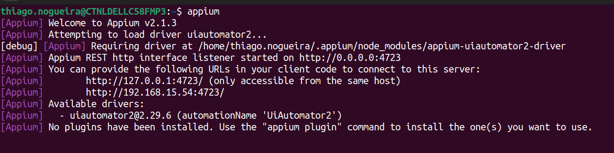
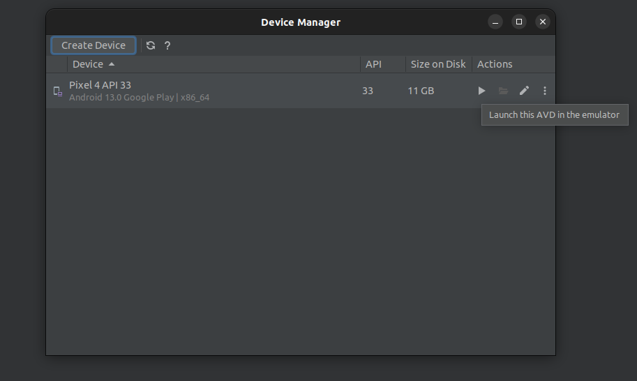

# Automação de testes Mobile com Robot Framework e Appium.

<h1>
    
</h1>

## Pré-requisitos de ambiente 📋💻

[Java](https://www.oracle.com/br/java/technologies/downloads/#java11) 11.0.20.

[Node.js](https://nodejs.org/en) 18.17.1.

[Python](https://www.python.org/downloads/) 3.10.12.

[Android Studio](https://developer.android.com/studio) Giraffe.

```
npm install -g appium@2.1.3
```

```
npm install -g appium-doctor
```

```
appium driver install uiautomator2
```
### Necessário configurar o **`ANDROID_HOME`** e **`JAVA_HOME`** no **`PATH`** do S.O.

### Pelo ***Virtual Device Manager*** do ***Android Studio***, crie um device.

### **Capabilities** configuradas no projeto de testes:

```
{
  "platformName": "Android",
  "appium:deviceName": "Android Emulator",
  "appium:automationName": "UIAutomator2",
  "appium:app": "<caminho-do-projeto>/app/yodapp-beta.apk",
  "appium:udid": "emulator-5554",
  "appium:autoGrantPermissions": true
}
```

## Comandos para checagem do ambiente ✅✅

* Se ambiente está OK: **`appium-doctor --android`**

* Se o driver está instalado: **`appium driver list --installed`**

* Se o virtual device está ativo / online: **`adb devices`**

## Instalação do projeto 🚀🚀

```
pip install -r requirements.txt
```

## Instruções 📢ℹ️ 

- Inicie o Appium Server com o comando: **`appium`**.



- Dê um play no Android Device Virtual.



## Execução dos testes 🤖🤖

```
robot -d ./logs tests/
``````

## Relatórios 📝 📄

Verifique a pasta `logs` para visualizar os <b>relatórios</b> da execução.

Abra o arquivo `report.html` ou `log.html` que é mais detalhado.

---

<a href="https://www.linkedin.com/in/thinogueiras"></a>

<strong>Thiago Nogueira dos Santos</strong> 🤓 🫰🏽

QA Automation Engineer 🔎 🐞